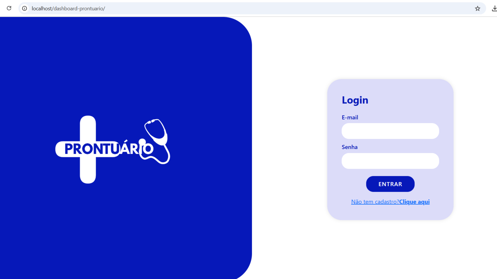
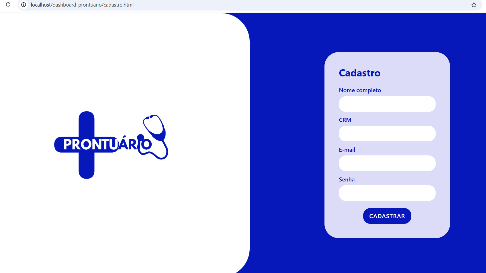

# 🩺 Prontuário+

Sistema web para gerenciamento de cadastros médicos que gerenciam o sistema de pacientes.

## 🚧 Em desenvolvimento...

Este projeto ainda está em fase de desenvolvimento. Por enquanto, as funcionalidades disponíveis incluem:

- Cadastro de médicos com:
  - Nome completo
  - CRM
  - E-mail
  - Senha criptografada
- Tela de login com autenticação segura
- Interface inspirada em design moderno e intuitivo

## 🛠 Tecnologias utilizadas

- HTML5, CSS3 (com Bootstrap)
- PHP (com PDO)
- MySQL

## 📁 Estrutura atual

(em desenvolvimento)

## 📌 Aviso

> Este sistema está sendo desenvolvido por estudantes como parte de um projeto educacional.  
> Novas funcionalidades e melhorias visuais serão adicionadas em breve.

---

Feito com 💙 pela Wisys!
